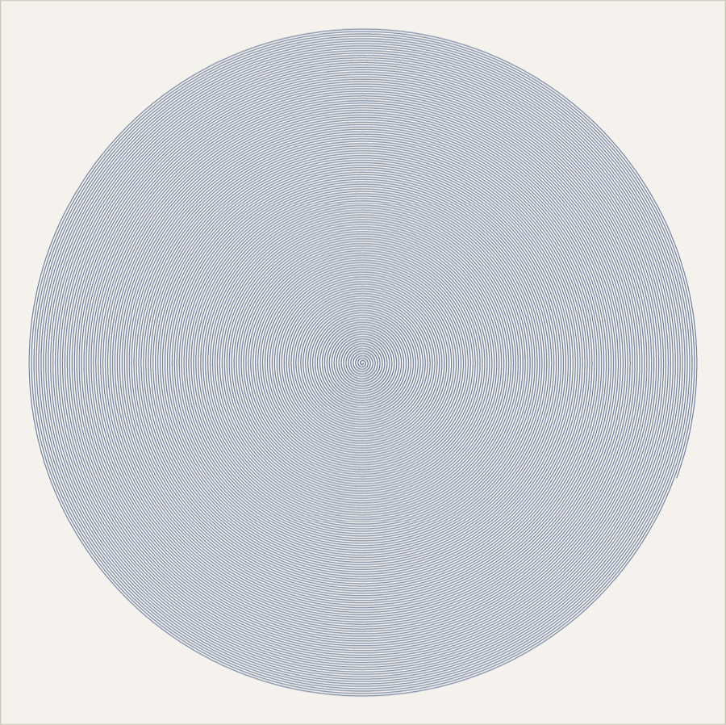

# StitchPeek

A macOS viewer, Quick Look preview, and Finder thumbnail generator for Tajima **DST**
embroidery files.

- **Quick Look preview** — spacebar a `.dst` in Finder and see the stitched design.
- **Finder thumbnails** — `.dst` files show the design as their icon.
- **Viewer app** — pan/zoom, per-color-block isolation, a stitch scrubber, a stats panel,
  recolorable blocks, and PDF/PNG export.



Requires macOS 14+. Built with Swift 6, SwiftUI for the shell, AppKit/Core Graphics for
rendering. Personal-machine distribution only — local ad-hoc signing, no notarization.

---

## Layout

```
Packages/StitchKit/          local Swift package, linked statically into all three targets
  Sources/StitchKit/         DSTParser, DSTHeader, Design, DesignRenderer, Palette
  Sources/stitchdump/        diagnostic CLI (records / stats / png)
  Tests/StitchKitTests/      29 tests + fixture corpus + reference goldens
StitchPeek/                  host app (the UTI declaration lives here)
StitchPeekPreview/           Quick Look preview extension
StitchPeekThumbnail/         Quick Look thumbnail extension
Scripts/                     fixture generation, reference decoder, cross-check, project gen
```

`StitchPeek.xcodeproj` is **generated** by `Scripts/generate_project.py` rather than
hand-edited, so target configuration stays reviewable in a diff. Editing the project in
Xcode is fine; just don't rerun the generator afterwards without re-applying your changes.

---

## Build, install, verify

```bash
# Xcode 26 is installed but xcode-select points at CommandLineTools on this machine,
# so DEVELOPER_DIR is set explicitly. To fix that permanently (needs your password):
#   sudo xcode-select -s /Applications/Xcode.app/Contents/Developer
export DEVELOPER_DIR=/Applications/Xcode.app/Contents/Developer

swift test --package-path Packages/StitchKit          # parser + renderer tests
xcodebuild -project StitchPeek.xcodeproj -scheme StitchPeek \
           -configuration Release -derivedDataPath build build

rm -rf /Applications/StitchPeek.app
cp -R build/Build/Products/Release/StitchPeek.app /Applications/
open /Applications/StitchPeek.app                     # must run once from its final location
```

Extensions do not register until the host app has launched from `/Applications`. Leaving the
app in DerivedData and expecting Finder to find it is the single most common cause of "my
extension doesn't work".

Confirm both extensions are present and enabled:

```bash
pluginkit -m -v | grep -i stitchpeek
```

They should be listed with a leading `+`. They are also visible under
*System Settings → General → Login Items & Extensions → Quick Look*.

---

## `.dst` may already be claimed by another app

`.dst` is a crowded extension. If **Embrilliance** is installed it exports
`com.britonleap.dst`, and LaunchServices then resolves `.dst` to **that** type rather than to
StitchPeek's own `com.bobbymarko.stitchpeek.tajima-dst` — so declaring only our own identifier
means the Quick Look extensions are never asked to do anything. (AutoCAD sheet sets and some
data-set exports also use `.dst`; check with `mdls -name kMDItemContentType` before assuming.)

StitchPeek therefore:

- **exports** `com.bobbymarko.stitchpeek.tajima-dst` (so `.dst` still has a type if
  Embrilliance is ever removed),
- **imports** `com.britonleap.dst`, and
- lists **both** in each extension's `QLSupportedContentTypes`.

Embrilliance ships no Quick Look plugins of its own, so previews and thumbnails do not
compete — StitchPeek is the only provider either way.

**Double-click is deliberately left alone.** StitchPeek claims `com.britonleap.dst` with
`LSHandlerRank = Alternate`, so it appears under *Open With* but does not take `.dst` away
from your actual embroidery editor as the default application. To change that, either use *Get Info → Open
with → StitchPeek → Change All…* in Finder, or edit `StitchPeek/Info.plist` and change that
entry's `LSHandlerRank` to `Owner`.

---

## Corrections to the handoff spec

These were found by testing against real files, and the code follows the corrected behavior.

### 1. The model is Y-**down**, and the renderer *does* need a flip

The spec is right that the decoder must negate `dy` (`y -= dy`, not `y += dy`) — verified
against pyembroidery and against header `+Y`/`-Y` on an asymmetric fixture.

It is **wrong** about what that leaves you with. §4.4 and §11 say the result is "design
space: +Y is up", that Core Graphics is also y-up, and therefore "do not add a flip". In
fact the negated coordinates are **y-down**: rendering them into a y-up context puts every
design upside down. Two independent confirmations:

- Rendering a real production file containing lettering y-up produces mirrored, upside-down
  text; y-down reads correctly. (Use a design with text in it — geometric marks are far too
  forgiving to catch this.)
- pyembroidery writes these same coordinates straight into SVG — a y-down coordinate
  system — with no transform.

So `DesignRenderer.fittingTransform` negates y (`d: -scale`). `OrientationTests` pins both
halves: that the decode matches the header, and that the transform maps the smallest model
y to the *top* of the context.

This is exactly the failure the spec warned would be easy to ship unnoticed — the real
files that caught it have symmetric *extents* (`+X 510 / -X 510`), so only the asymmetry of
the lettering exposed it.

### 2. `import QuickLook` does not compile on macOS

`QLPreviewProvider`, `QLPreviewReply`, and `QLPreviewingController` live in **QuickLookUI**
on macOS. The spec's `import QuickLook` is the iOS spelling.

### 3. The preview reply's argument label is `drawUsing:`, and the block takes two arguments

The real initializer is
`QLPreviewReply(contextSize:isBitmap:drawUsing: (CGContext, QLPreviewReply) throws -> Void)`,
not `drawingBlock: { ctx in ... }`.

### 4. A data-based preview extension must set `QLIsDataBasedPreview`

Missing from the spec entirely, and the most expensive omission. Without

```xml
<key>QLIsDataBasedPreview</key><true/>
```

in `NSExtensionAttributes`, Quick Look treats the extension as the **view-based** kind,
looks for a view controller, and never instantiates `QLPreviewProvider` — the extension
loads and silently does nothing, with no error in any log. Apple's own data-based preview
extension (`QLPreviewGenerationExtension.appex`) sets the same key.

### 5. `qlmanage -p` and `qlmanage -t` are not the acceptance tests the spec assumes

On macOS 26.5, plain `qlmanage -t` hangs forever on any file handled by a modern `.appex`
generator (it only drives the old in-process `.qlgenerator` path), and `qlmanage -p -o` dies
with an `NSInvalidArgumentException` inside `ExtensionFoundation` — including for Apple's
*own* data-based preview extension, so it is a `qlmanage` bug, not yours.

Use `-x`, which routes through `quicklookd`, the path Finder actually uses:

```bash
qlmanage -x -t -s 512 -o /tmp/out some.dst     # works
```

Thumbnail caching is aggressive; test with a filename that has never been thumbnailed
before, or the result is a cache hit rather than a run of your code.

---

## Testing

```bash
swift test --package-path Packages/StitchKit
```

29 tests. The one that matters most is the **cross-check against the Python reference
decoder**: every fixture is decoded by `Scripts/reference_decoder.py`, serialized
canonically, and hashed; the Swift decoder must produce a byte-identical stream.
`Scripts/make_fixtures.py` regenerates both the fixtures and the goldens.

To check the parser against files too large or too private to commit:

```bash
swift build -c release --package-path Packages/StitchKit
python3 Scripts/crosscheck.py ~/some/folder-of-dst-files
```

This was run against 22 real production files — all 22 matched the reference decoder
record for record.

`stitchdump` is useful on its own:

```bash
Packages/StitchKit/.build/release/stitchdump stats some.dst
Packages/StitchKit/.build/release/stitchdump png   some.dst out.png 900
```

### Performance

Budget is under 1s for 200k stitches. Actual, for the 220k-stitch `huge.dst` fixture:
**~0.1s** to parse and render at 900×900.

---

## Debug playbook

Run in order; don't start randomly changing plists.

```bash
# Registered and enabled?
pluginkit -m -v | grep -i stitchpeek

# What type does the system actually resolve a .dst to?
mdls -name kMDItemContentType some.dst

# Who claims the type?
/System/Library/Frameworks/CoreServices.framework/Frameworks/LaunchServices.framework/Support/lsregister \
  -dump | grep -i -A5 'tajima-dst'

# Exercise the generator through quicklookd (NOT plain -t, see correction 5)
qlmanage -x -t -s 512 -o /tmp/qlout some.dst

# Caches
qlmanage -r && qlmanage -r cache && killall quicklookd && killall Finder

# Re-register after moving the app
lsregister -f /Applications/StitchPeek.app
```

If a rebuild's behavior doesn't change, `killall quicklookd` — it holds onto a loaded copy
of the extension.

---

## Colors and export

DST stores no color information, only "change color here", so block colors come from
`Palette` in stitching order. **Click a swatch in the inspector to change one.** Because the
file has no colors to change, a recolor is a display choice, not an edit: nothing is written
back and nothing is persisted, so reopening the file returns to the palette assignment.
Right-click a block to reset it, or use *Reset Colors* in the section header.

The two exports differ on purpose:

- **PDF (⌘E)** is a one-page report — the whole design over a table of its statistics:
  dimensions in inches and mm, stitch/jump/trim counts, estimated thread and bobbin
  consumption, estimated run time, and a per-block breakdown with swatches.
- **PNG** is exactly what is on screen, at the current pan and zoom.

Both honour the viewer's toggles (isolated block, jump overlay, stitch limit).

Thread length is measured from the run geometry. Bobbin consumption is the usual
one-third-of-top rule, and run time assumes 650 stitches per minute; both are labelled as
estimates in the report because DST records neither. Checked against another DST tool's
report for the same file, the stitch count, dimensions, trim count, thread length and bobbin
figures all agree.

## Licence

MIT — see [LICENSE](LICENSE). The app icon artwork is not mine to relicense; it is
© Bobby Marko and is excluded from the MIT grant.

## Non-goals

Editing or writing DST. Other formats (PES, EXP, JEF, VP3) — the model is deliberately
format-agnostic so they can be added behind the same `Design` type, but none are
implemented. Thread-brand matching. Printing. iOS.

DST carries **no color information** — only "change color here". Unless the header has `TC:`
entries, block colors come from `Palette`, a fixed 16-color list indexed by stitching order,
so the same file always renders identically.
